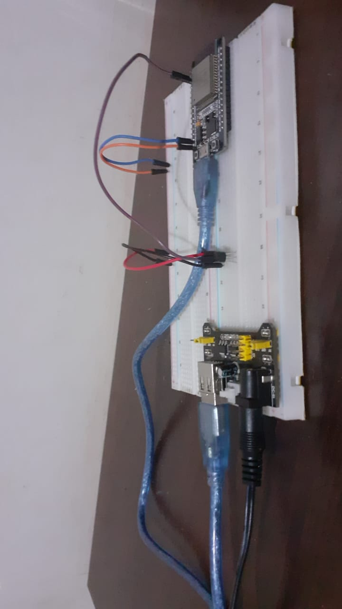

# Remote Sensor Esp32

Aplicação desenvolvida para microcontrolador Esp32 para gerenciar a coleta de temperatura do sensor Lm35.

* [App](https://github.com/DA0HN/remote-sensors-app)
* [API](https://github.com/DA0HN/remote-sensors-api)

# TODO

- [ ] adicionar interrupção na coleta de temperatura
- [ ] adicionar requisição da API para configurar o delay de coleta
- [ ] refatorar para adicionar mais sensores ao Esp32